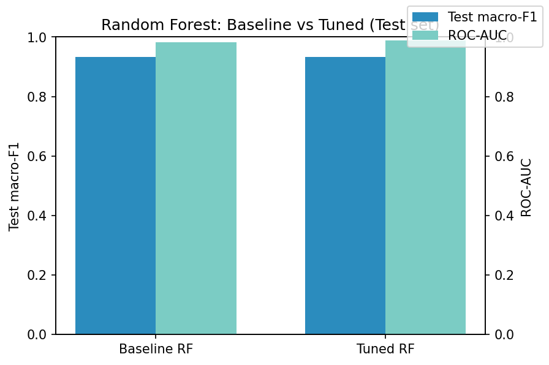
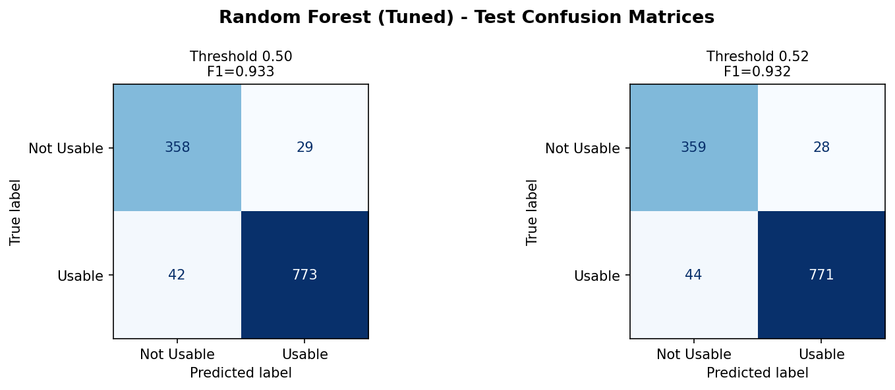
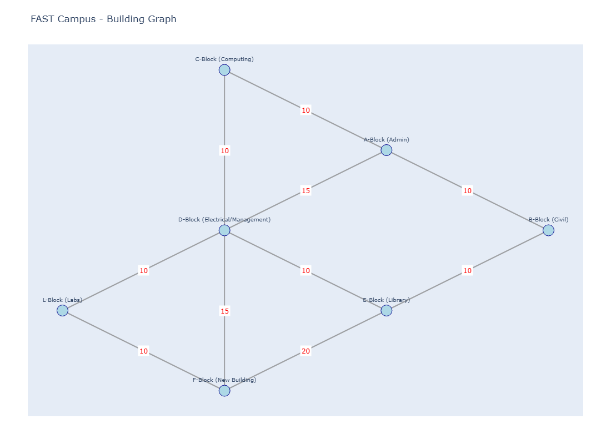
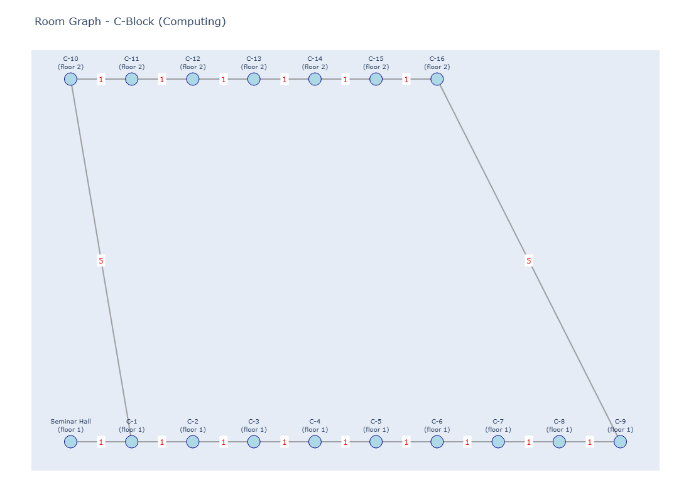
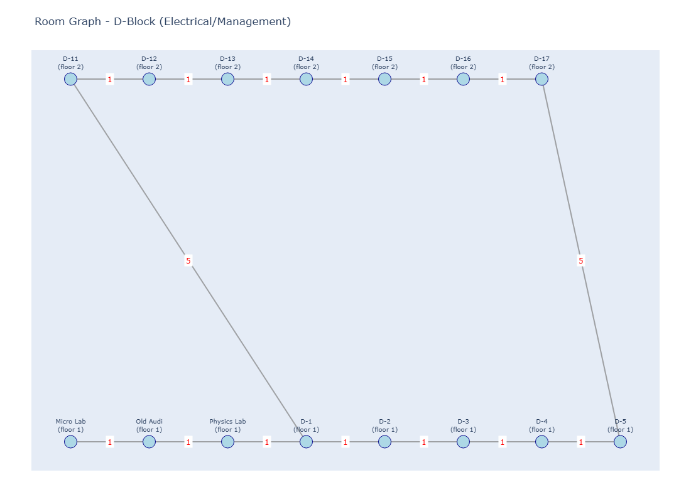
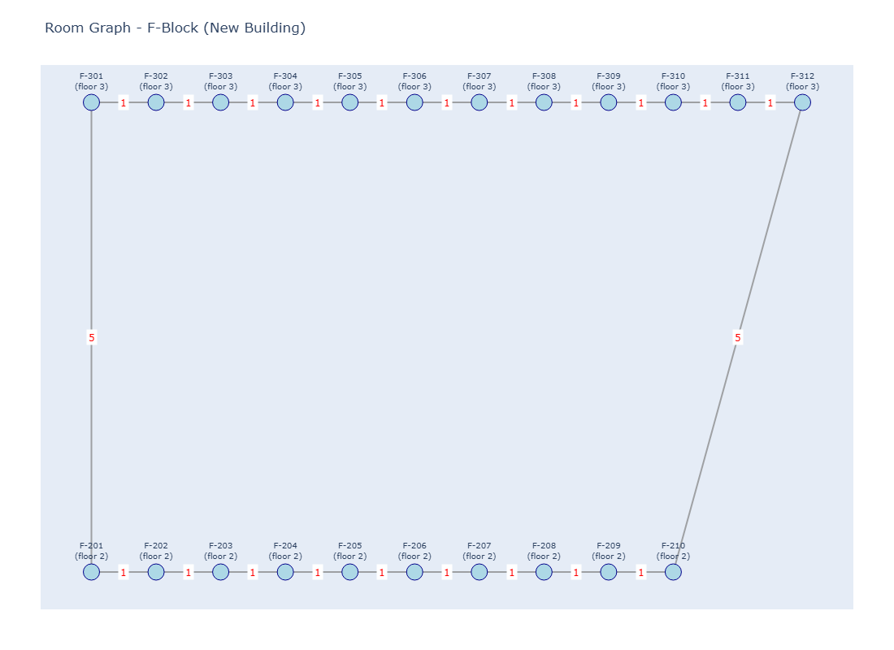
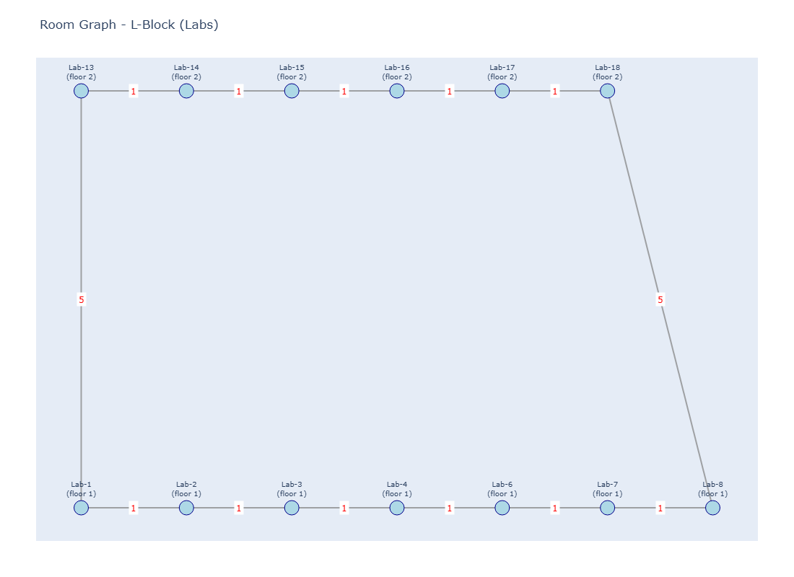

# 🏫 Smart Campus Navigator
### ML-Powered Hierarchical Pathfinding for FAST-NUCES Campus

> Navigate from any room to any other room across the FAST-NUCES campus using a two-layer A* search, fully integrated with a Machine Learning model that predicts room usability to ensure you never walk across campus to a noisy or occupied room.

---

## 📌 What Does This Project Do?

Imagine you're standing in **Room F-201** and want to find the best place to study. Pure distance-based pathfinding might tell you to walk to **F-202**, but what if a loud class is happening next door?

**Smart Campus Navigator** solves this by combining spatial graph theory with machine learning:

1. **Reads real university timetables** to build a catalog of every room and its occupancy.
2. **Builds a spatial graph** — running a two-layer A* algorithm to find the exact walking distance between any two rooms.
3. **Trains a Machine Learning Model** — an optimized Random Forest that predicts the "Usability" (quietness/availability) of a room based on the time of day, block congestion, and neighboring classes.
4. **Calculates "Smart Cost"** — artificially inflates the walking distance of noisy rooms, tricking the A* algorithm into routing you to guaranteed quiet spaces.
5. **Deploys a Streamlit App** — a beautiful, interactive web dashboard that allows students to test paths, compare Pure A* vs. Smart A*, and verify recommendations against live timetable ground truth.

---

## 🗂️ Repository Structure

```
Smart_Campus_Navigator/
├── README.md                          ← You are here
├── EXECUTION_GUIDE.md                 ← Project phases & reflection
├── config.py                          ← Campus topology configuration
│
├── Data/                              ← Extracted room data & ML datasets
├── Models/                            ← Trained ML models (.pkl)
├── Results/                           ← ML training reports and CM plots
├── TimeTables/                        ← Source Excel files (FSC + FSM)
├── Uni_diagrams/                      ← PNG snapshots of building graphs
├── University_Graph/                  ← Interactive HTML visualisations
│
├── Refrehers/                         ← Highly detailed component explainers
│   ├── 7_dataset_generation_guide.md
│   ├── 8_train_model_refresher.md
│   ├── 9_tune_random_forest_refresher.md
│   ├── 10_compare_model_runs_refresher.md
│   ├── 11_smart_navigator_refresher.md
│   └── 12_app_refresher.md
│
└── scripts/
    ├── 1_to_4: Data extraction & HTML graph generation
    ├── 5_hierarchical_navigator.py    ← Core A* pathfinding engine
    ├── 6_test_navigator.py            ← Automated A* correctness tests
    ├── 7_generate_dataset.py          ← ML: Builds 19-feature dataset
    ├── 8_train_model.py               ← ML: Trains baseline models
    ├── 9_tune_random_forest.py        ← ML: Hyperparameter tuning
    ├── 10_compare_model_runs.py       ← ML: Generates comparison leaderboards
    ├── 11_smart_navigator.py          ← Engine: Combines A* and ML predictions
    └── 12_app.py                      ← UI: The final Streamlit web application
```

---

## 🚀 Quickstart

### 1. Install Dependencies

```bash
pip install pandas networkx plotly matplotlib openpyxl scikit-learn streamlit
```

### 2. Launch the Web App
The quickest way to see the project in action is to launch the Streamlit interface:
```bash
streamlit run scripts/12_app.py
```
This will open the beautiful UI in your browser where you can test different routing presets (like "Cross-Block Mix") and see the ML predictions live.

### 3. Re-train the AI (Optional Pipeline)
If you want to generate the dataset and retrain the models from scratch:
```bash
python scripts/7_generate_dataset.py
python scripts/8_train_model.py
python scripts/9_tune_random_forest.py
python scripts/10_compare_model_runs.py
```

---

## 🧠 The Machine Learning Engine

The core innovation of this project is the **Smart Cost** routing engine.

### The Problem with A*
Standard A* only cares about distance. If you ask it for a room, it will give you the closest one, even if it's completely packed.

### The ML Solution
Script 11 injects a Machine Learning penalty into the A* path cost:
```python
Smart Cost = Pure Distance + (Penalty Scale × (1 - Usability Probability))
```
The **Usability Probability** is generated by a highly-tuned **Random Forest Classifier** trained on 6,000+ synthetic timetable scenarios. It evaluates 19 features, including:
- Temporal data (Hour, Day, Sin/Cos cyclic time)
- Block-level congestion rates
- Micro-congestion (Are classes running in the immediately adjacent rooms?)

If the ML model predicts a room will be noisy (Usability = 10%), the penalty skyrockets, and the Smart A* algorithm actively avoids it, preferring to route you slightly further away to a guaranteed quiet room.

### Model Evaluation & Results
The **Random Forest** algorithm was selected after baseline testing against Logistic Regression and Neural Networks. It was then heavily tuned using `RandomizedSearchCV` to optimize the hyperparameter tree depth and decision boundary threshold.



*The tuned Random Forest achieves an outstanding Macro-F1 score of >0.93.*



---

## 🏛️ Campus Overview — The Building Graph

The campus consists of **7 buildings** connected by walking paths with hand-tuned travel costs. 
Inside each building, rooms on the same floor are connected by **corridors (cost = 1)** and floors are connected by **staircases (cost = 5)**.



* **A-Block:** Admin
* **C-Block:** Computing
* **D-Block:** Electrical / Mgmt
* **E-Block:** Library
* **F-Block:** New Building
* **L-Block:** Labs

### Room-Level Graphs (Examples)

**C-Block (Computing)**  


**D-Block (Electrical & Management)**  


**F-Block (New Building)**  


**L-Block (Labs)**  


The navigator uses a **two-layer hierarchical approach**:
1. Pathfinding inside the Start Building to find the nearest exit.
2. Pathfinding across the Campus Graph to the Destination Building.
3. Pathfinding inside the Destination Building to the Goal Room.

---

## 💻 Streamlit Web Application

`12_app.py` ties everything together into a modern SaaS-style dashboard.

**Key Features:**
* **Live Timetable Verification:** Before making a final recommendation, the app double-checks the prediction against the raw Excel timetables to guarantee you don't walk into a live lecture. It even tells you exactly how many hours the room will remain free!
* **Fallback Alternatives:** If the ML's top pick is surprisingly occupied, the app intelligently falls back to the next best vacant recommendations.
* **Algorithm Comparison:** The UI forces a side-by-side battle between "Pure A*" and "Smart A*", making it incredibly easy to demonstrate the value of the ML integration.

---

## 📚 Further Reading & Documentation

To deeply understand this project, refer to the included documentation:

1. **`Refrehers/` Folder:** Contains 6 meticulously detailed markdown files explaining the exact mathematical and programmatic mechanics of scripts 7 through 12. Highly recommended for Viva preparation.
2. **`EXECUTION_GUIDE.md`:** A higher-level reflection on the project phases, failure analysis, and ethical considerations.

---

*FAST-NUCES Karachi Campus — Spring 2026*
