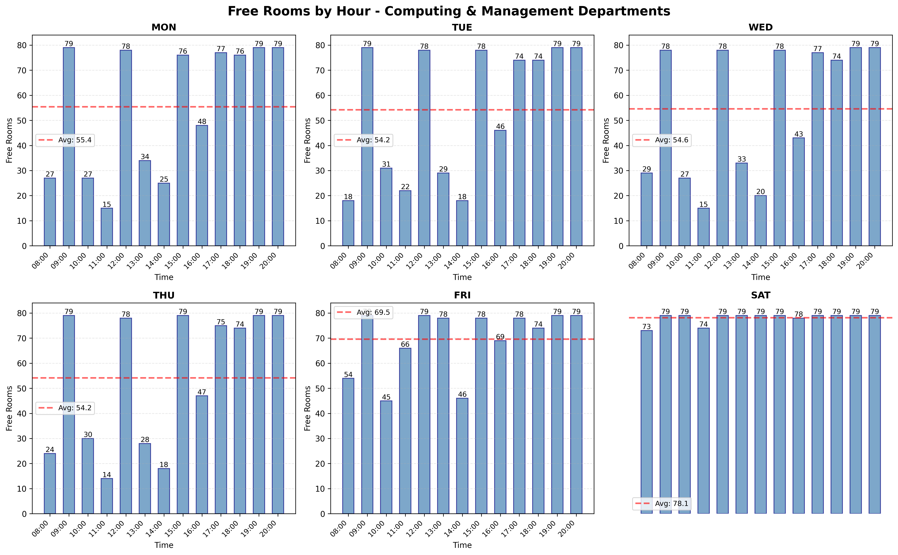

**Smart Campus Navigator**

- **Overview:**: A compact research / engineering project that parses university timetables, builds a room-level and building-level spatial model of a campus, visualises the graphs, and provides a hierarchical navigation engine (A*). The project is intended as a reproducible demonstration of data engineering, algorithm design, and system integration — a strong portfolio piece for recruiters.

**Repository Layout**
- **Files:**: [README.md](README.md) — this file.
- **Data & Artifacts:**: [all_rooms.csv](all_rooms.csv), [rooms_complete.csv](rooms_complete.csv), [room_timetable.xlsx](room_timetable.xlsx), [room_availability_histogram.png](room_availability_histogram.png)
- **Scripts:**: See `scripts/`:
  - **1_extract_rooms.py**: Merge/extract room list from timetables (produces `all_rooms.csv`).
  - **2_free_rooms_hourly_availability.py**: Hourly free-room analysis and histogram (produces `room_availability_histogram.png`).
  - **3_extract_occupancy_by_room.py**: Produce room-centric timetable Excel (`room_timetable.xlsx`).
  - **4_visualise_graph.py**: Create interactive HTML visualisations of building and room graphs (saved to `University_Graph/`).
  - **hierarchical_navigator.py**: Navigation engine — hierarchical A* (room-level + building-level).
  - **test_navigator.py**: Unit tests / expectations for navigation.

**Design & Decision Framework**

**1) Data ingestion and room modelling**
- **Goal:** produce a canonical list of rooms with building & floor metadata that other components can rely on.
- **Decisions:**
  - Parse both Computing (FSC) and Management (FSM) timetables and merge unique room names; this avoids depending on a single source and handles naming differences.
  - Classify rooms by simple deterministic rules (`classify_room()` in [scripts/3_extract_occupancy_by_room.py](scripts/3_extract_occupancy_by_room.py)): prefix heuristics plus explicit mapping for special names (Old Audi, CRMG, Micro Lab, Seminar Hall). Rule-based classification is robust, explainable, and easy to adjust.
  - Infer floor via numeric patterns (`extract_floor_number()`): interpretable heuristic that works for formats like `F-201`, `C-10`, `Lab-1`.

**Why this approach:** Clean deterministic extraction gives reliable inputs for routing and visualization without needing manual data cleaning or fragile regexes; it is easy to audit for correctness.

**2) Spatial modelling & graphs**
- **Two-layer model:**
  - **Building graph (macro):** Nodes are buildings, edges have hand-tuned walking costs (e.g., F ↔ D = 15). Positions used for visualization are stored in `config.py` as `BUILDING_POS`.
  - **Room graph (micro):** For each building, rooms are nodes; corridor edges connect adjacent room numbers on the same floor (cost = 1); stairs are explicit edges defined in `STAIRS_CONFIG` (cost = 5).

**Decisions & rationale:**
  - Corridor adjacency by numeric ordering is simple, deterministic, and matches site maps: nearby room numbers are usually physically adjacent.
  - Explicit stairs: some buildings have stair connections not derivable from numbering; these are enumerated in `STAIRS_CONFIG` so the routing graph matches reality.
  - Separate graphs allow hierarchical search (room-level A* inside buildings + building-level A* between buildings) which keeps search space small and modular.

**3) Pathfinding: Hierarchical A***
- **Formulation:** We compute paths as three segments: start → start-building-exit, building-path (sequence of building nodes), exit → goal. The total cost is the sum of: intra-building path costs + building-graph path cost + intra-building path costs at destination.

- **Heuristic design (key contribution):**
  - At both the building-level and room-level we use Euclidean straight-line distances scaled conservatively to ensure **admissibility** (never overestimates true cost) and **consistency/monotonicity** (g(n) + h(n) never decreases along edges). That lets us apply A* correctly and achieve optimality while improving performance over plain Dijkstra.
  - Implementation detail: compute minimal ratio r = min(edge_weight / euclidean(u,v)) across edges (for buildings or rooms). Then heuristic h(x) = r * euclidean(pos(x), pos(goal)). Because every edge cost >= r * euclid(edge), h is admissible.

**Why this heuristic:** It is domain-aware (uses real layout positions) and conservative (scaling ensures correctness). It reduces nodes expanded compared to h=0 while guaranteeing optimal paths.

**4) Visualisation & Debugging**
- The project includes `scripts/4_visualise_graph.py` which produces per-building and campus-level HTML visualisations in `University_Graph/`. These make the topology and edge weights explicit and help validate stairs, corridor adjacency, and building positions.
- The room position logic: for each building, rooms are grouped by floor; rooms on a floor are sorted by their numeric suffix; X coordinate is proportional to sorted index, Y coordinate maps to floor. This makes same-floor room chains linear and stair links vertical — ideal for readable visual maps.

**How to run (quick start)**
- Setup: ensure you have Python 3.10+ and packages in `requirements.txt` (pandas, networkx, plotly, matplotlib, openpyxl). If you want, I can export a `requirements.txt` for you. Example install:

```bash
python -m pip install pandas networkx plotly matplotlib openpyxl joblib
```

- Generate the visual graphs (writes into `University_Graph/`):

```bash
python scripts/4_visualise_graph.py
```

- Run the navigator demo and tests:

```bash
python scripts/hierarchical_navigator.py    # demo run
python scripts/test_navigator.py           # run unit tests (11 tests expected)
```

**Files to inspect**
- **Config:**: [config.py](config.py) — centralizes `BUILDING_GRAPH`, `BUILDING_POS`, and `STAIRS_CONFIG` so you can tune weights and layout in one place.
- **Visuals:**: Open `University_Graph/building_graph.html` and the `room_graph_*.html` files with a browser. The histogram `room_availability_histogram.png` is available at repo root.

**Testing & Validation**
- `scripts/test_navigator.py` encodes several realistic scenarios (same-floor, different-floor, cross-building) and asserts expected cost ranges. After the heuristic change all tests pass locally (11/11).

**Engineering trade-offs and notes for recruiters**
- **Rule-based parsing vs ML for extraction:** Chosen rule-based parsing for determinism and auditability (parsing correctness is crucial for navigation). Machine learning could classify rooms from messy text, but adds opacity and data needs.
- **Hierarchical A*:** Combining micro and macro graphs reduces search cost compared to a single monolithic graph. It also maps directly to how humans think when navigating (exit-building → cross campus → enter target building).
- **Heuristic scaling approach:** Conservative scaling ensures A* correctness while using spatial intuition. This is a pragmatic compromise between pure geometric heuristics (fast but possibly inadmissible if weights differ) and blind search.

**Next steps & extensions (recommended)**
- Add `scripts/recommender.py` to combine occupancy predictions with path costs (top-k recommendations). The project already contains `ml_integration.py` scaffolding for a classifier.
- Add dynamic weights (e.g., crowding or stairs accessibility) to favour accessible routes.
- Add a REST API wrapper for the recommender & navigator for integration with a web or mobile frontend.

**Attribution & contact**
- The repository demonstrates data parsing, graph modelling, A* heuristic design, and visualization — good interview talking points: explain how you ensured admissibility, how you derived stair edges, how you tested routing on edge cases.

**Selected visuals**
- Room availability histogram: 
- Campus graph & per-building visualisations: open `University_Graph/building_graph.html` and the `room_graph_*.html` files in a browser for interactive diagrams.

---
If you'd like, I can also:
- Add a `requirements.txt` and `setup` instructions.
- Add a short `README_SAMPLE.md` with one-page talking points for interviewing.
- Implement `scripts/recommender.py` and a simple CLI or Flask API.

If you want any changes to tone/length or to include inline static PNG thumbnails for the room graphs, tell me which images to embed and I will add them to the repo and update this README.
